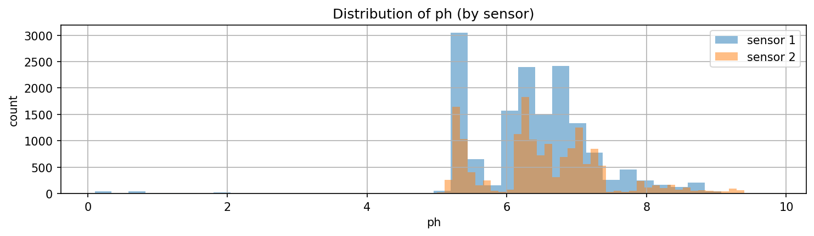
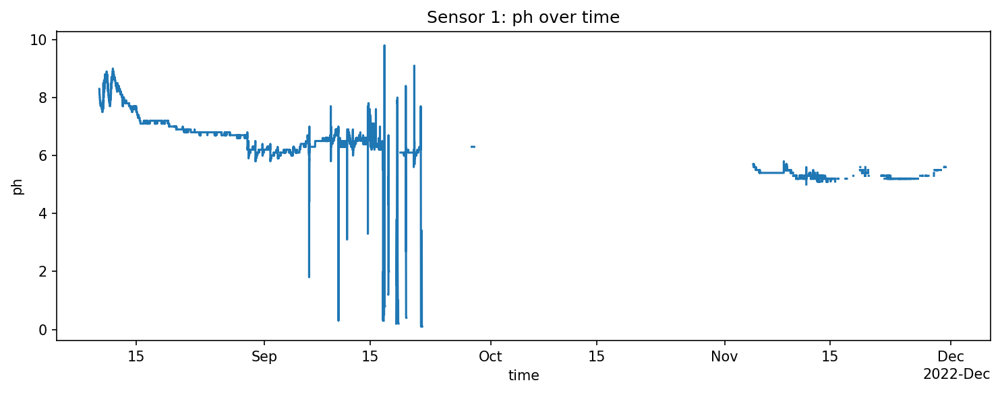

# Hydroponics IoT EDA and Preprocessing

Exploratory data analysis and preprocessing workflow for IoT sensor data from an autonomous hydroponics system.

## Overview
This repository focuses on my contribution to a team project on hydroponics IoT analytics. My work centered on exploratory data analysis, data cleaning, missing-value handling, segmentation of time-series gaps, and feature engineering for downstream modeling.

## My Contribution
I led the EDA and preprocessing portion of the project, including:
- loading and inspecting raw IoT sensor data
- cleaning timestamps and numeric sensor fields
- identifying outages and segmenting continuous sensor runs
- handling placeholder zero values in water-quality variables
- applying limited within-segment forward filling
- engineering time-based and rolling-window features
- visualizing sensor behavior, missingness, and trends

Model development and evaluation were completed by my teammates.

## Dataset
The project uses IoT sensor data from an experimental autonomous hydroponics platform, including variables such as:
- water temperature
- pH
- electrical conductivity
- dissolved oxygen

## EDA and Cleaning Workflow
### 1. Timestamp parsing
Timestamps were parsed as UTC-aware datetimes, and invalid timestamps were removed.

### 2. Numeric coercion
Sensor columns were converted to numeric values, with non-numeric entries coerced to missing values.

### 3. Gap detection and segmentation
To avoid leaking information across outages, the time series was split into continuous segments whenever the gap between readings exceeded 10 minutes.

### 4. Placeholder zero cleanup
Exact zeros in pH, EC, and dissolved oxygen were treated as invalid readings and converted to missing values.

### 5. Missing-value handling
Short missing stretches were forward-filled only within the same sensor and continuous segment, with a limited fill window.

### 6. Feature engineering
I added time-based features and 1-hour rolling mean features to support downstream modeling.

## EDA Highlights

### pH Distribution by Sensor
This histogram compares the distribution of pH readings across the two sensors. It helps show overall range, central tendency, and potential differences in sensor behavior.



### Sensor 1 pH Over Time
This time-series plot shows how pH readings from Sensor 1 changed over time, including periods of instability, abrupt drops, and gaps that informed the cleaning and segmentation strategy.



## Tools Used
Python, pandas, matplotlib, seaborn, Jupyter Notebook

## Repository Structure
```text
.
├── notebooks/
│   └── eda.ipynb
├── figures/
├── requirements.txt
└── README.md
